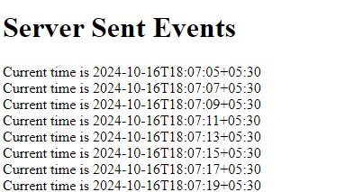

## Server Sent Events
Server pushes updates to the client over a single HTTP connection

1. Set up the HTTP server:<br>
```
http.ListenAndServe(":8000", nil)
```
2. Write the HTTP handler to send events: <br>
We send current timestamps, wrapped in `fmt.Fprintf` and flush the data.
```
SSEHandler(w http.ResponseWriter, r *http.Request)
    for {
		fmt.Fprintf(w, "data: Current time is %s\n\n", time.Now().Format(time.RFC3339))

		// flush the data to the client - immideately, not buffer
		if f, ok := w.(http.Flusher); ok {
			f.Flush()
		}
    }
```
3. Set up the [client](./index.html) to listen to the events:<br>
```
const eventSource = new EventSource("http://localhost:8080/events");

// Listen for messages from the server
eventSource.onmessage = function(event) {
    const newElement = document.createElement("div");
    newElement.textContent = event.data;
    document.getElementById("events").appendChild(newElement);
};
```

#### Result


