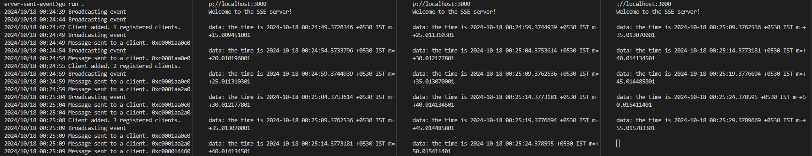

## Broker Server Sent Events
Similar to message queues like RabbitMQ, this broker broadcasts notifications to all connected clients.
The server uses `[]byte` as data type, to handle any type(images, strings).

#### Broker Architecture:
The broker manages multiple clients using dedicated channels for each. For every new client that connects, the broker creates a unique chan []byte for that client.

- Manages client connections using channels and a map.
- `Notifier`: Channel for broadcasting events to all clients.
- `newClients` & `closingClients`: Channels to handle registration and removal of clients.
- `clients`: A map to track active clients.

Broker may handle delegation of resource management and cleanup, ensuring smooth client registration and deregistration, even in cases where clients disconnect abruptly.
That's why we have `clients`, `newClients`, `closingClients` as seaparte entities in the struct.

#### Why Separate Channels?
Each client has its own unique channel for receiving messages. Using separate channels ensures:

1. Message Isolation: Messages are routed to specific clients.
2. No Overlap: Clients only receive messages meant for them.
3. Concurrency Control: Each client's connection is handled independently, avoiding messy disconnections or errors that could affect others.

If a shared channel was used for all clients, several issues could arise:

- Message Overlap: All clients would receive every message, even if not relevant.
- Lack of Control: There would be no way to target individual clients.
- Concurrency Issues: Disconnection of one client could disrupt the entire system.
Broker Responsibilities

#### Result
To run the server
```
go run .
```
For each new client run, we can see the client id being printed as well.
```
curl -N http://localhost:3000
```


#### References
- [Basic Server Sent Event implementation](../09-basic-server-sent-events/)
- [Sever sent event in GO](https://thoughtbot.com/blog/writing-a-server-sent-events-server-in-go)
- [Golaong HTML SSE example](https://github.com/kljensen/golang-html5-sse-example/blob/master/server.go)