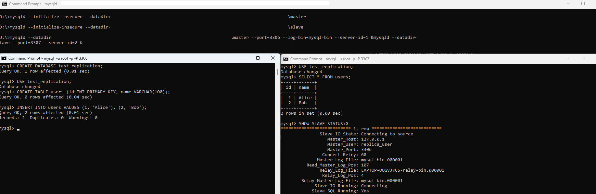

## Set up MySql ans Replica Locally
Create multiple data directories `mysql-master` and `mysql-slave`, and initialize both instances.
```
mysqld --initialize-insecure --datadir=/mysql-master
```
```
mysqld --initialize-insecure --datadir=/mysql-slave
```
Start both instances on different ports.
```
mysqld --datadir=/mysql-master --port=3306 --log-bin=mysql-bin --server-id=1 &
mysqld --datadir=/mysql-slave --port=3307 --server-id=2 &
```

### Configure Master Instance
```
mysql -u root -p -P 3306
```
Create Replication User
```
CREATE USER 'replica_user'@'localhost' IDENTIFIED BY 'replica_password';
GRANT REPLICATION SLAVE ON *.* TO 'replica_user'@'localhost';
FLUSH PRIVILEGES;
```
```
SHOW MASTER STATUS;
```

### Configure Slave Instance
```
mysql -u root -p -P 3307
```
Configure Slave to connect to master
```
CHANGE MASTER TO
    MASTER_HOST='127.0.0.1',
    MASTER_USER='replica_user',
    MASTER_PASSWORD='replica_password',
    MASTER_PORT=3306,
    MASTER_LOG_FILE='mysql-bin.000001',  # From master status
    MASTER_LOG_POS=107;  # From master status
```
Start replication
```
START SLAVE;
```
Check the slave status
```
SHOW SLAVE STATUS\G
```

### Testing Replication
On the master instance, create DB and insert data
```
CREATE DATABASE test_replication;
USE test_replication;
CREATE TABLE users (id INT PRIMARY KEY, name VARCHAR(100));
INSERT INTO users VALUES (1, 'Alice'), (2, 'Bob');
```

On the slave instance check the replication
```
USE test_replication;
SELECT * FROM users;
```

#### Result
