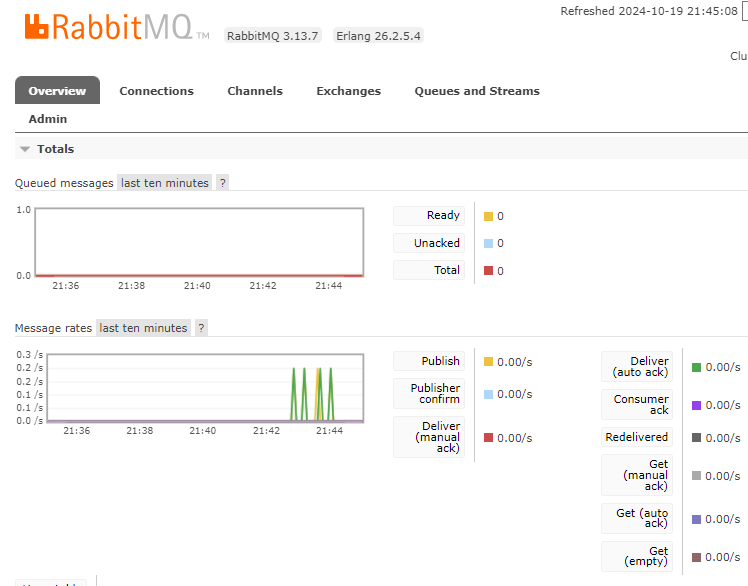
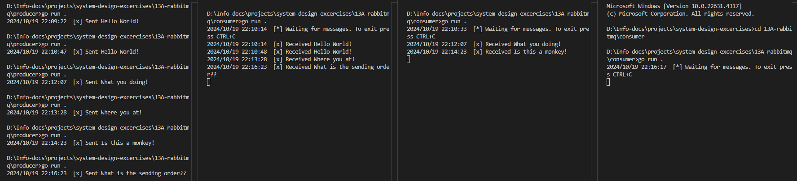

## RabbitMQ

#### Run RabbitMQ Docker
We can access the  RabbitMQ UI at `http://localhost:15672`
```
docker run -d --name rabbitmq -p 5672:5672 -p 15672:15672 rabbitmq:3-management
```




#### Run producer and consumer scripts


1. Single producer sends messages to multiple consumers connected to the same queue.
2. RabbitMQ distributes the messages in a **round-robin** fashion, so each consumer gets a fair share of messages.
3. Each message is processed by only one consumer, unless the consumer fails to acknowledge it (in manual acknowledgment mode).
#### Stop the RabbitMQ Docker Container
```
docker stop rabbitmq;
docker rm rabbitmq
```