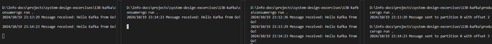

## Kafka
#### Start Zookeeper
Zookeeper was used to manage the Kafka brokers (keeping track of brokers, partitions, and consumers)
```
docker run -d --name zookeeper -p 2181:2181 zookeeper
```
#### Start Kafka
```
docker run -d --name kafka -p 9092:9092 \
  --link zookeeper \
  --env KAFKA_ZOOKEEPER_CONNECT=zookeeper:2181 \
  --env KAFKA_LISTENERS=PLAINTEXT://0.0.0.0:9092 \
  --env KAFKA_ADVERTISED_LISTENERS=PLAINTEXT://localhost:9092 \
  wurstmeister/kafka
```

To validate, we run `docker ps` and we should see both zookeper and kafka running.

#### Run Producer and Consumer Scripts

Kafka's message distribution depends heavily on consumer groups and partitions.
1. If consumers are part of different groups, they will each receive all the messages.
2. If consumers are part of the same group, Kafka will distribute the messages across them (i.e., each message will only be consumed by one consumer in the same group).
3. **Push vs. Pull**: Kafka consumers pull data from Kafka, unlike some systems where messages are pushed to consumers.




#### Stop Container
```
docker stop kafka
docker rm kafka
```

