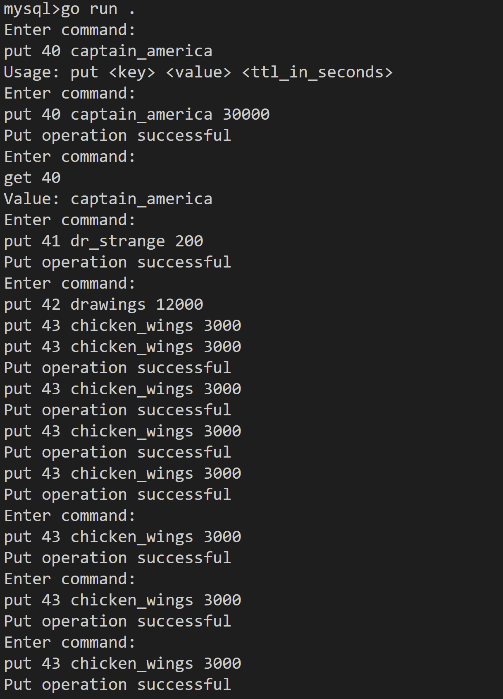
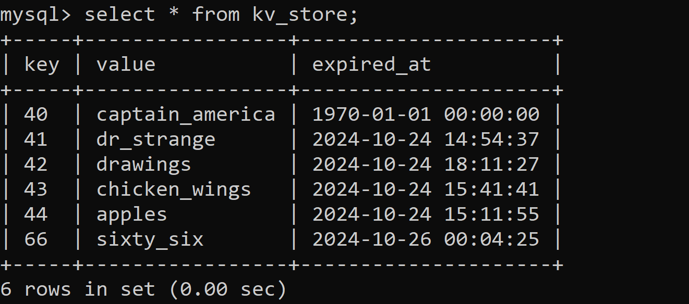
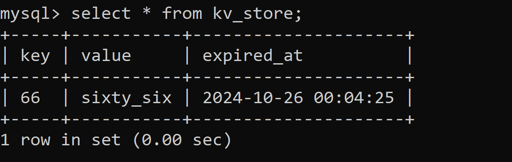

## Implementing a KV Store on top of MySQL
Implementing `put`, `get`, `del`, `ttl` operations all in sync.
To implement this in space efficient way, following is our table structure :
```
+------------+--------------+
| Field      | Type         |
+------------+--------------+
| key        | varchar(255) |
| value      | text         |
| expired_at | datetime     |
+------------+--------------+
```
#### Running `put` operation
Put Query:
```
REPLACE INTO kv_store VALUES (?,?,?)
```




#### Running `get`, `del`, `ttl` operations
Get Query:
```
SELECT value FROM kv_store WHERE `key` = ? AND expired_at > NOW()
```
Del Query:
```
UPDATE kv_store SET expired_at = '1970-01-01' WHERE `key` = ? AND expired_at > NOW()
```
TTL expiry Query:
```
DELETE FROM kv_store WHERE expired_at <= NOW() LIMIT 1000
```


#### KV store after the automatic go routine to delete expired keys
We run a go-routine `ttlCleanupRoutine` that cleans expired keys after every 2 minutes.
