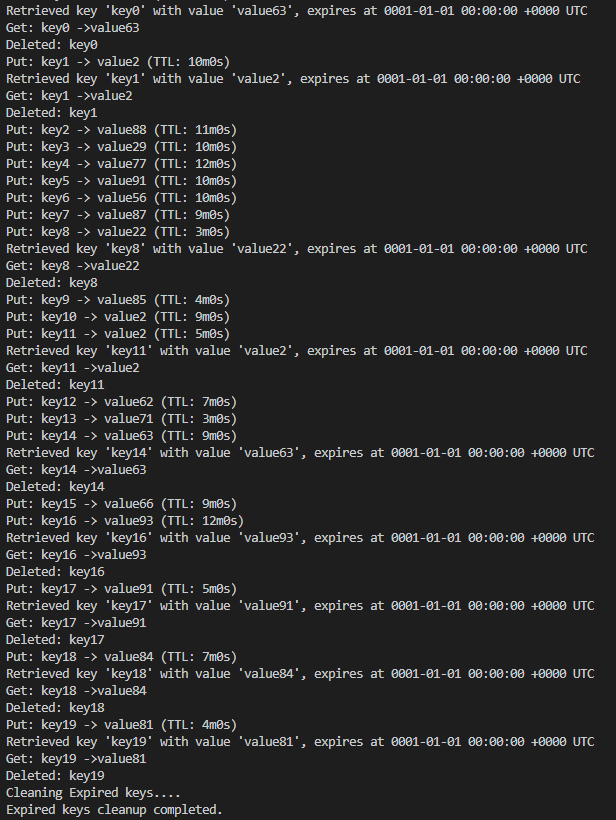
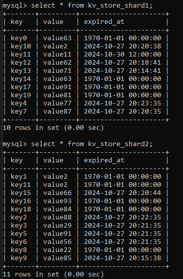
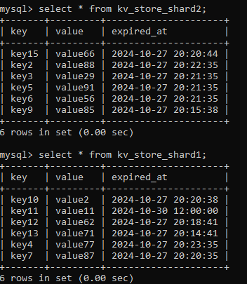

## Implementing Routing Strategy in KV Store on top of MySQL

- Implementing `put`, `get`, `del`, `ttl` operations all in sync. <br>

- We create 2 tables and 2 connections simulating **DB Partitions** `kv_store_shard1` and `kv_store_shard2`. <br>
NOTE: Naming of the tables wrong - should be partition not shard

- Run the `set_db.sql` file to create DB, and partitions.
Run: `mysql -u root -p < <path to set_db.sql>`

- Implementing Routing technique, using a consistent hashing mechanism.
```
hash := sha256.Sum256([]byte(key))
idx := int(hash[0]) % shardCount
```

- Randomly get, put, del values.

[Implementation of simple KV Store](../15A-kvstore-mysql/)

#### Logs to the kvstore 


#### Before cleanup


#### After cleanup
