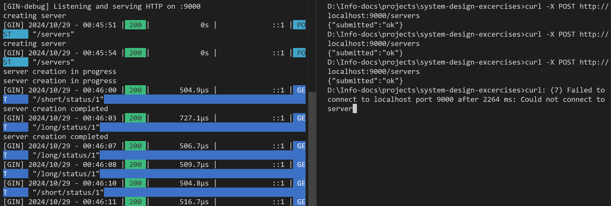
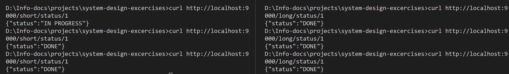

## Implementing Short Polling and Long Polling

#### 1. Mock EC2 creation with sleep
Create a table `p_servers` to store the status of the EC2.
```
CREATE TABLE IF NOT EXISTS p_servers (server_id INT PRIMARY KEY AUTO_INCREMENT, status VARCHAR(20));
```
`createEC2` function mimics the stages of an EC2 server creation, updating a database table (p_servers) with status values (TODO, IN PROGRESS, and DONE) over time. <br>

**POST /servers:**
- Returns a JSON response ({"submitted": "ok"})
- Implies that the server creation would be initiated here.

#### 2. Define API that client can do to short poll the status
`/short/status/:server_id` is the endpoint where the client keeps polling frequently to get the server’s latest status. <br>

**GET /short/status/:server_id (Short Polling):**
- Takes a server_id and retrieves the latest status from the p_servers table.
- Client repeatedly makes this request to get updates on the server's status.

#### 3. Define API that client can do to long poll the status
`/long/status/:server_id` holds the request open and only responds once there’s a change in status. <br>

**GET /long/status/:server_id (Long Polling):**
- The server will continue checking the status in a loop until it detects a status change.
- The client makes a single request and waits for a response only when the status has actually changed. This reduces the need for constant polling.

#### Result


Short poll and Long poll status
