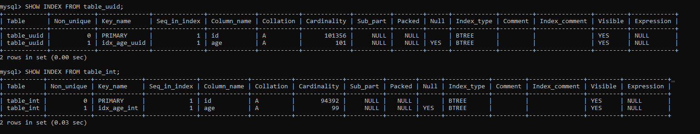
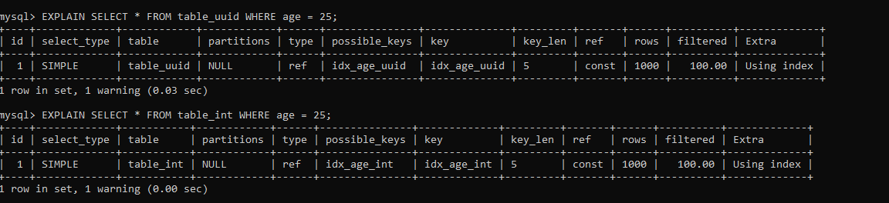

## Benchmark the impact of UUID on relational database as Primary Key

- Create two tables with identical schema
    - ID (4 byte auto_inc int), Age (4 byte int)
    - ID (16 byte varchar). Age (4 byte int)
- Insert 1 million rows on each table and measure the time taken
- Create the index on age column and measure the size of the index

#### Creating Tables
```
CREATE TABLE table_int (
    id INT AUTO_INCREMENT PRIMARY KEY,
    age INT
);
```
```
CREATE TABLE table_uuid (
    id VARCHAR(36) PRIMARY KEY,
    age INT
);
``` 

#### Inserting Values Time Taken
| Rows (n) | Time Taken for INT Table | Time Taken for UUID Table |
|----------|---------------------------|---------------------------|
| 1        | 7.1296 ms                 | 2.1831 ms                 |
| 10       | 22.1931 ms                | 23.2998 ms                |
| 100      | 240.4256 ms               | 237.2309 ms               |
| 1000     | 2.4304686 s               | 2.287058 s                |
| 5000     | 11.3897624 s              | 21.1369527 s              |
| 10000    | 1m 30.2903405 s           | 25.8839489 s              |
| 50000    | 4m16.8766564s             |    3m3.266271s            |
| 100000   | 5m43.1322233s          |   6m30.6969113s            |


#### Creating Index
Index creation on table_int (age): 601.9155ms
```
CREATE INDEX idx_age_int ON table_int(age);
```
Index creation on table_uuid (age): 1.1390565s
```
CREATE INDEX idx_age_uuid ON table_uuid(age);
```

#### Measure Index Size
```
SHOW TABLE STATUS LIKE 'table_int';
SHOW TABLE STATUS LIKE 'table_uuid';
```
### Comparison of `table_int` and `table_uuid`

| Field               | `table_int`                      | `table_uuid`                   |
|---------------------|----------------------------------|---------------------------------|
| **Rows**            | 336,193                          | 83,845                          |
| **Avg_row_length**  | 29 bytes                        | 94 bytes                        |
| **Data_length**     | 9,977,856 bytes                  | 7,913,472 bytes                 |
| **Index_length**    | 0 bytes (no indexes reported)    | 0 bytes (no indexes reported)   |


Total number of rows in both tables is same, but Row Count different? WHY?
WHY insertion in int took more time??
```
SELECT COUNT(*) FROM <table_name>;
+----------+
| COUNT(*) |
+----------+
|   100000 |
+----------+
```

**Average Row Length**:
The average row length for `table_int` is 29 bytes, while for `table_uuid`, it's 94 bytes. This suggests that the UUIDs, being 16 bytes long, contribute to a larger average row size due to additional overhead in storing data associated with each UUID.



### Conclusion
- The `table_int` is more populated and has a smaller average row length, which is generally favorable for performance.
- the `table_uuid` table has larger row sizes due to the nature of UUIDs, leading to a potentially higher overhead in storage and retrieval..