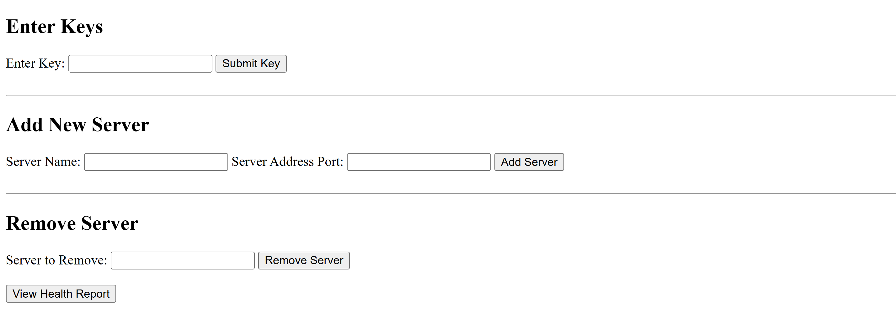
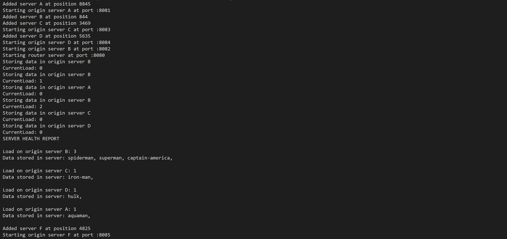

## Load Balancer with Consistent Hashing

1. Setup: 4 Origin Servers and 1 load balancer for routing requests to the origin servers.

2. Routing Logic:  Use consistent hashing. Storing servers in the hashspace using their name. We store the keys on the rightmost node. 
[Sample Implementation](../27A-consistent-hashing/)

3. Data Handling:
   - Simulate saving data to the appropriate origin server based on the hashed key.

4. HTML Form in Router: Created a web-based interface to:
    - Submit keys for routing and saving.
    - View server health.
    - Add or remove origin servers dynamically.

6. Health Monitoring: Display load on each origin server, at `:8080/health`.

7. Data Migration on Server Removal: TODO

Form to enter data

Health Server `:8080/health`

Adding New Server F, and sending data

Remove Server A

Logs

