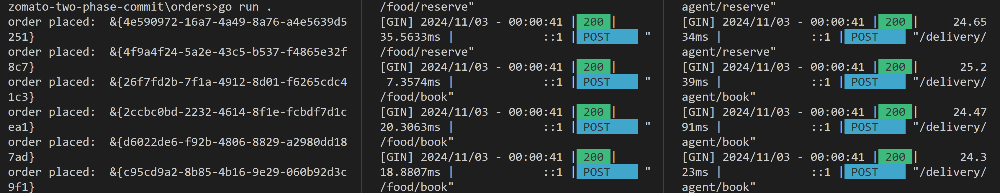

## Distributed Transactions
[Reference](https://www.youtube.com/watch?v=oMhESvU87jM)

#### Two Phase Commit
Spilt the flow into 2 phases:
1. Prepare - Reserve
2. Commit - Assign

#### DB Schema
```
+------------------+
| Tables_in_zomato |
+------------------+
| agents           |
| foods            |
| packets          |
+------------------+
```
```
agents                           foods                      packets
+-------------+-------------+    +-------+-------------+    +-------------+-------------+
| Field       | Type        |    | Field | Type        |    | Field       | Type        |
+-------------+-------------+    +-------+-------------+    +-------------+-------------+
| id          | int         |    | id    | int         |    | id          | int         |
| is_reserved | tinyint(1)  |    | name  | varchar(50) |    | food_id     | int         |
| order_id    | varchar(30) |    +-------+-------------+    | is_reserved | tinyint(1)  |
| name        | varchar(30) |                               | order_id    | varchar(30) |
+-------------+-------------+                               +-------------+-------------+
```


1. Reserve Food :
```
SELECT * FROM packets
WHERE is_reserved is false AND food_id=? AND order_id is NULL
LIMIT 1
FOR UPDATE
```
```
UPDATE packets SET is_reserved = true
WHERE id = ?
```
update 
2. Reserve Agent :
```
SELECT id FROM agents
WHERE is_reserved is false AND order_id is NULL
LIMIT 1
FOR UPDATE
```
```
UPDATE agents SET is_reserved = true
WHERE id = ?
```
3. Assign Food :
4. Assign Agent : 

