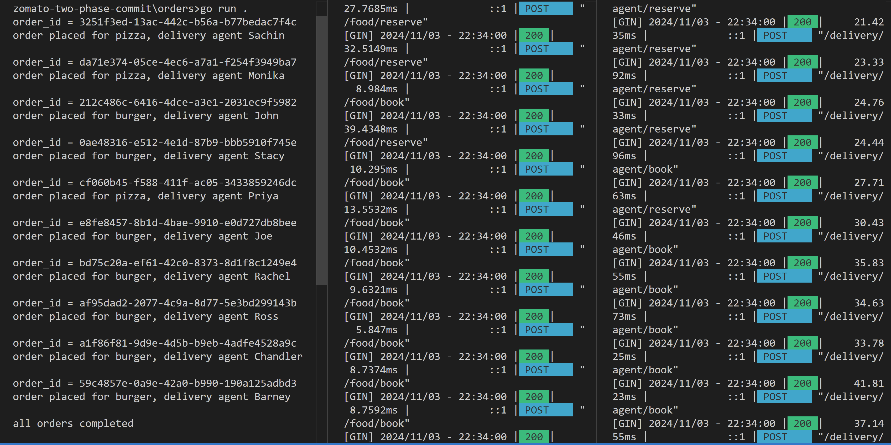
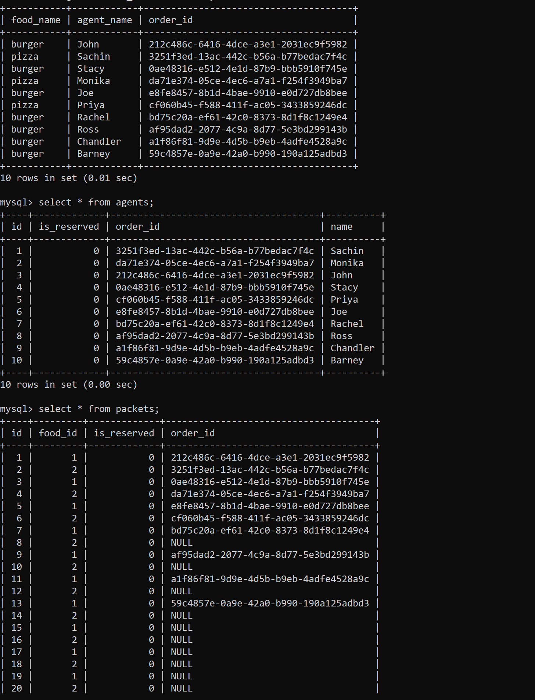

## Implementing Zomato's Ordering service
Distributed Transactions using 2 phase commit protocols.
[Reference](https://www.youtube.com/watch?v=oMhESvU87jM)

```
                    +-----------------+
                    |     User        |
                    +-----------------+
                              |
                              v
                    +-----------------+
                    |  Order Service  |
                    +-----------------+
                         /       \
                        v         v
            +----------------+  +----------------------+
            |  Food Service  |  |Delivery Agent Service|
            +----------------+  +----------------------+
```

#### Two Phase Commit
Spilt the flow into 2 phases:
1. Prepare - Reserve
2. Commit - Assign
```
orders          store           delivery
  |               |                 |   
  |reserve food   |                 |   
  |-------------->|@timer           |   
  |               |                 |   
  |reserve agent  |                 |   
  |---------------|---------------->|@timer
  |               |                 |   
  |assign food    |                 |   
  |-------------->|                 |   
  |               |                 |   
  |assign agent   |                 |   
  |---------------|---------------->|
  |               |                 |

```

#### Database Schema
```
+------------------+
| Tables_in_zomato |
+------------------+
| agents           |
| foods            |
| packets          |
+------------------+
```
```
agents                           foods                      packets
+-------------+-------------+    +-------+-------------+    +-------------+-------------+
| Field       | Type        |    | Field | Type        |    | Field       | Type        |
+-------------+-------------+    +-------+-------------+    +-------------+-------------+
| id          | int         |    | id    | int         |    | id          | int         |
| is_reserved | tinyint(1)  |    | name  | varchar(50) |    | food_id     | int         |
| order_id    | varchar(30) |    +-------+-------------+    | is_reserved | tinyint(1)  |
| name        | varchar(30) |                               | order_id    | varchar(30) |
+-------------+-------------+                               +-------------+-------------+
```


- Reserve Food :
```
SELECT id FROM packets
WHERE is_reserved is false AND food_id=? AND order_id is NULL
LIMIT 1
FOR UPDATE
```
```
UPDATE packets SET is_reserved = true
WHERE id = ?
```

- Assign/Book Food :
```
SELECT id FROM packets
WHERE food_id = ? AND is_reserved = true AND order_id IS NULL
LIMIT 1
FOR UPDATE
```
```
UPDATE packets SET is_reserved = false, order_id = ?
WHERE id = ?
```

- Reserve Agent :
```
SELECT id FROM agents
WHERE is_reserved is false AND order_id is NULL
LIMIT 1
FOR UPDATE
```
```
UPDATE agents SET is_reserved = true
WHERE id = ?
```

- Assign/Book Agent :
```
SELECT id FROM agents
WHERE is_reserved = true AND order_id IS NULL
LIMIT 1
FOR UPDATE
```
```
UPDATE agents SET is_reserved = false, order_id = ?
WHERE id = ?
```

#### Output

