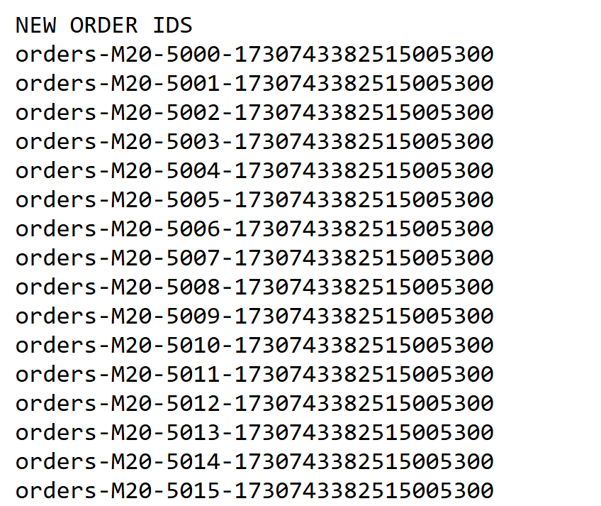
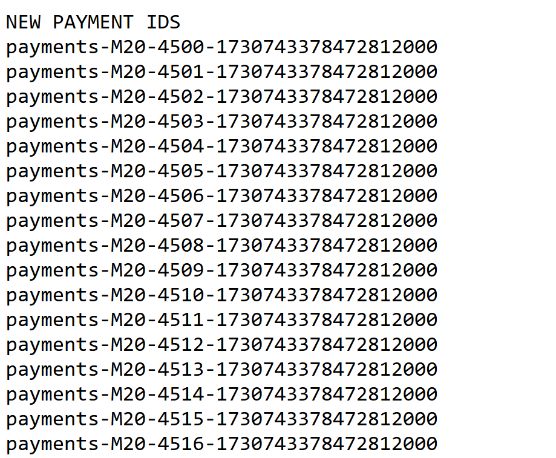

## Implementing Amazon's way for ID generation

Implementing a Central ID Generation service with batching.

- Ids returned in batches of 500 `get_batch_id()`
- counter persisted after batchSize - on machine reload.

Orders ID        |  Payments ID
:-------------------------:|:-------------------------:
  | 