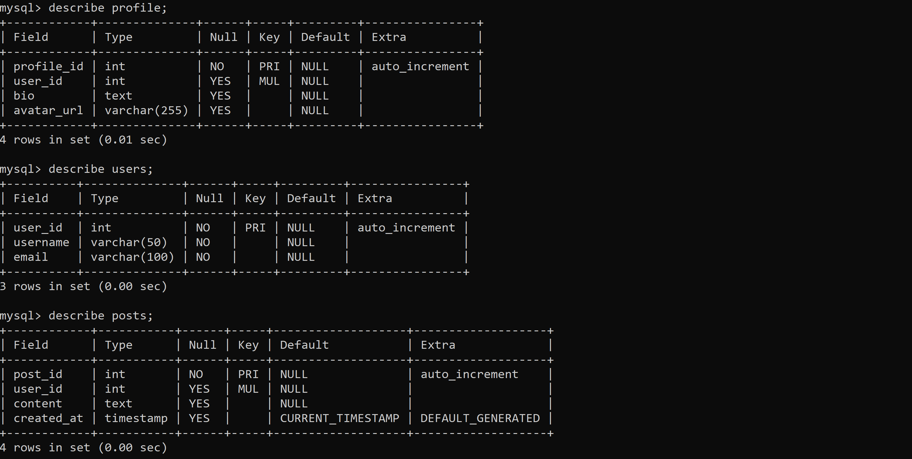
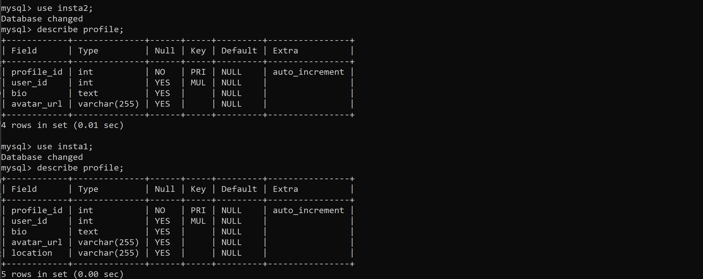
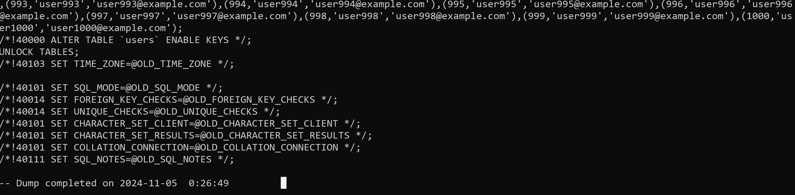

## Benchmark pagination approaches
### Excercise
1. Benchmark using
    1. Limit Offset
    1. ID Limit
1. Implement multiple Logical Shards and Physical Servers
    1. Create multiple databases - insta1, insta2, etc.
    1. Create posts, users, profile table with same schem across all
    1. Alter the schema of one of the table to understand how tedious alter tables would be
    1. create a new database server (on some other port)
1. Dump data from one shard and load it on another
    1. use mysqldump utility for this
    1. Implement this by iterating over rows to understand how slow and complex the process would be

### Implementation
#### 1. Set Up
1. Set DB variables
`set DBUSER = <your_database_user>` <br>
`set DBPASS = <your_database_password>`

2. Run the `set_db.sql` file to create DBs `insta1` and `insta2`, and tables `posts`, `users`, `profile`
Run: `mysql -u root -p < <path to set_db.sql>`

3. Insert 1000 records into the DBs.
`go run insert_db_data.go`




#### 2. Benchmark Pagination
Run: `go run benchmark_pagination.go`

**Pagination** is a technique to split large datasets into smaller, manageable chunks or "pages" for easier display and access, often in applications or websites with large databases (e.g., listing posts or products).

**Limit Offset Pagination**
```
SELECT * FROM posts ORDER BY created_at DESC LIMIT 10 OFFSET 20;
```

**ID Limit Pagination**
```
SELECT * FROM posts WHERE post_id > ? ORDER BY post_id ASC LIMIT 10;
```

| Limit     | Limit-Offset Pagination (ms)     |ID Limit Pagination (ms)      |
|-----------|----------------------------------|------------------------------|
| 10        | 37.4124                          | 22.9061                      |
| 50        | 15.5417                          | 8.834                        |
| 100       | 9.0521                           | 5.1739                       |

- **Limit-Offset Pagination** uses SQL's `LIMIT` and `OFFSET` to fetch specific "pages" of records. However, as `OFFSET` grows larger, the database has to scan increasingly more rows to locate the starting point, making it slower with large datasets.
  
- **ID-Based Pagination** uses a unique ID as a pointer to retrieve the next set of records (`WHERE id > last_id LIMIT X`). This approach is generally faster because it avoids scanning unnecessary rows by directly locating records based on indexed IDs.

#### 3. Alter schema in one shard

```
USE insta1;
ALTER TABLE profile ADD COLUMN location VARCHAR(255);
```


#### 4. Migrate Data Between Shards using `mysqldump`
Dump Data of `insta1`
```
mysqldump -u root -p --databases insta1 > insta1_dump.sql
```
Load Data on `insta2`
```
mysqldump -u root -p --databases insta2 < insta1_dump.sql
```


#### 4. Migrate Data Between Shards by iterating row by row
Run: `go run rowdump.go`
```
Total rows migrated: 1000
Total migration time: 2.6671554s
```