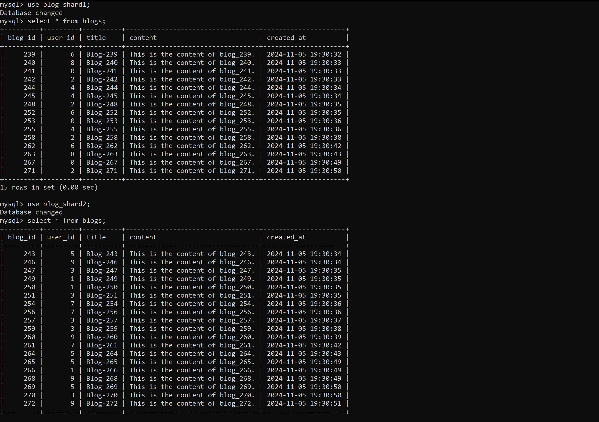
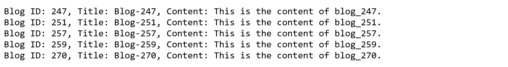

## Blog Application
Implement a simple blogging application where you shard by user id; and try to provide a unique ID to each blog. The idea is to understand the need to ID generation when database is sharded.


- We create 2 DBs blogs_shard1, blogs_shard2: both with same table blogs.
- Enter data based on the userId.
- Generate unique blogIDs, and persist by locally saving it.

```
+------------+--------------+------+-----+-------------------+-------------------+
| Field      | Type         | Null | Key | Default           | Extra             |
+------------+--------------+------+-----+-------------------+-------------------+
| blog_id    | bigint       | NO   | PRI | NULL              |                   |
| user_id    | int          | NO   |     | NULL              |                   |
| title      | varchar(255) | YES  |     | NULL              |                   |
| content    | text         | YES  |     | NULL              |                   |
| created_at | timestamp    | YES  |     | CURRENT_TIMESTAMP | DEFAULT_GENERATED |
+------------+--------------+------+-----+-------------------+-------------------+
```


```
http://localhost:8000/create_blog
```

```
http://localhost:8000/fetch_blog/userid-3
```

