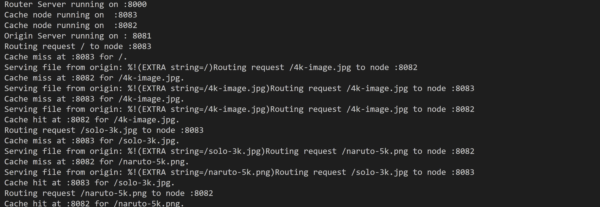

## Implement Toy CDN

Implement a basic Content Delivery Network (CDN) simulation.

```
                +--------+         +--------+         +--------+
User Request -> | Router | ----->  | CDN    | ----->  | Origin |
                +--------+         | Nodes  |         | Server |
                                   +--------+         +--------+
                                    /      \
                                   /        \
                           +-----------+    +-----------+
                           | Cache     |    | Cache     |
                           | Node 1    |    | Node 2    |
                           +-----------+    +-----------+
```

1. Origin Server: Hosts the original files and responds to requests. Serves files from `./static` directory. We add 5s delay to simulate network latency.

2. Cache Nodes: Cache content to reduce load on the origin server. Note the cache hit and cache miss.

3. Round-Robin Router: Sits in front of the cache nodes, distributing incoming requests to them in a round-robin manner.

Add images/video to a `static` folder - which will be fetched by the origin.
