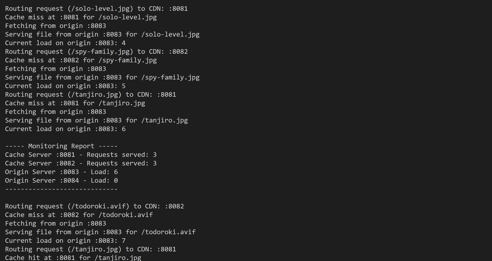

## Go CDN Load Balancer with Monitoring
- Simulates a basic Content Delivery Network (CDN) with load balancing, caching, and monitoring, using Go. 
- Includes origin servers and cache servers, with routing requests managed by a central router.
- Monitoring function runs in a separate goroutine, periodically reporting server loads and request distribution.

#### Excercise
Mimick CDN Failover
1. Configure multiple properties on same CDN under different CDN hostnames
1. Configure same website as origin for it.
1. For a given request, confire that 80% go to origin 1 while 20% goes to origin 2
1. Do this by creating CDN urls in the backend response
```
                         +-----------+           +------------------+
              |-> Router | CDN HostA |-----> 80% |  Origin Server 1 |
              |          +-----------+           +------------------+
              |             |
              |             |                     +------------------+
              |             |--------------> 20%  |  Origin Server 2 |
              |                                   +------------------+
User Request --
              |         +-----------+           +------------------+
              -> Router | CDN HostB |----> 80%  |  Origin Server 1 |
                        +-----------+           +------------------+
                           |
                           |                     +------------------+
                           |--------------> 20%  |  Origin Server 2 |
                                                 +------------------+

```
#### Project Structure
- Router: Routes incoming requests to cache servers in a round-robin manner.
- Cache Servers: Serve cached content if available; otherwise, fetch from origin servers.
- Origin Servers: Store original content and serve it to cache servers on cache misses.
- Monitoring: Tracks the number of requests handled by each server.

#### Usage

- Run the project with: `go run main.go`
- Create a folder named `./static` with all images and videos.
- Endpoints:
    - The router listens on port :8000 and forwards requests to cache servers.
    - Cache servers listen on ports :8081 and :8082.
    - Origin servers listen on ports :8083 and :8084.

#### Output



Final Report
```
----- Monitoring Report -----
Cache Server :8081 - Requests served: 16
Cache Server :8082 - Requests served: 17
Origin Server :8083 - Load: 11
Origin Server :8084 - Load: 2
-----------------------------
```
