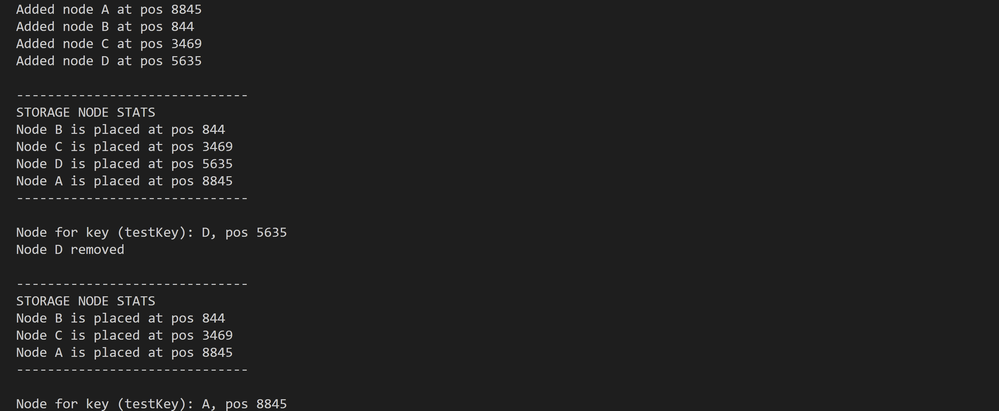

## Implement Consistent Hashing
Reference: [Consistent Hashing Blog](https://arpitbhayani.me/blogs/consistent-hashing/)

- Create a hash space of 10,000 slots.
- Store `StorageNode` positions in the hash space in a sorted array.
- Use SHA-256 to hash each node's name and map it to a position in the hash space.
- Insert and remove nodes in the sorted array using binary search.

- To place a key within the nodes:
  - Hash the key using the same SHA-256 function to map it to the hash space.
  - Use binary search to find the rightmost `StorageNode` responsible for the key's position, then assign the key to that node.

