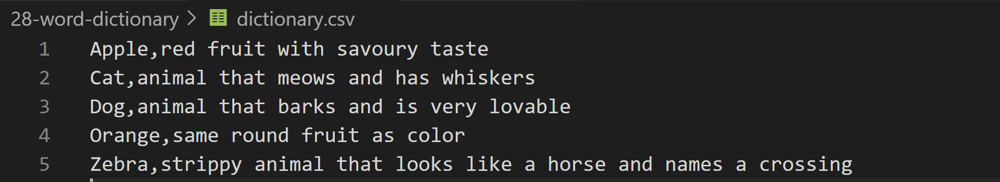
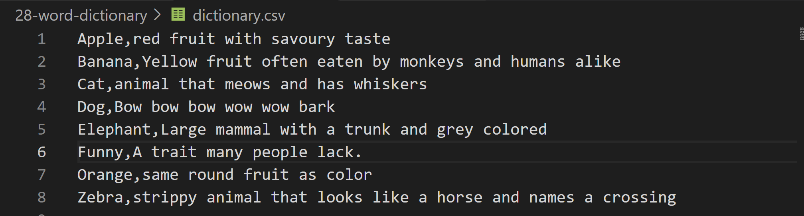
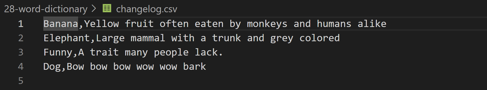
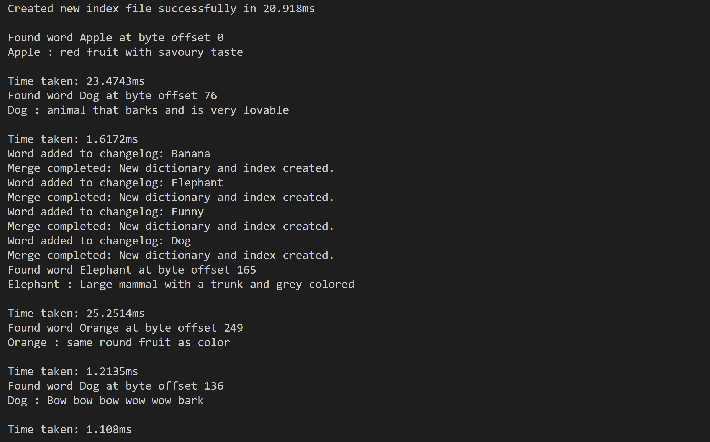

##  Implementing Word Dictionary without DB

- `wordLookUp()` : uses the `index.dat` file to search the offset of the word in the dictionary, in time O(1).
- `addWord()` : to add or update new words in the dictionary. Changelog is maintained in sorted order. New dictionary is created by merging the old dictionary and change log (MergeSort)

- **TODO:** Merge the 2 files - dictionary and index, to make the files poratable. Add a header to store the metadata. (approach 3)<br>
- **TODO:** Create a write ahead log (WAL) before the merging the change log, incase the system crashes.

Initial Dictionary


Dictionary after merge


Index `.dat` File


ChangeLog


Logs

### Theory

#### System Requirements - READ HEAVY
- Weekly updates to words and meanings.
- Singular lookups.
- Handle 170,000 words with a total size of 1 TB.
- Avoid repetitive entries.
- Maintain storage-compute separation.
- Serve as the foundation for multi-layered storage or a **data lake**.

#### Approach 1: One File per Word
- Store each word in a separate file: `s3://word-dictionary/a/apple.txt`.
- **Issue**: Poor portability and high management overhead.

---

#### Approach 2: Single CSV File with Index
- A single `.csv` file containing all words and meanings.
- A separate index file `.dat` storing the offset of each word for fast lookups.
- **Index File Size**: `171,476 x (average word length + separator + newline) ≈ 2.6 MB`.
- **Lookup**: Use the index file to locate the position of a word in the CSV file for fast retrieval.
- **Updating the Dictionary**
    1. Maintain a sorted **changelog** for updates.
    2. Download the dictionary and merge it with the changelog (sorted merge `O(n)`).
    3. Generate new data and index files, then upload them to S3.
    4. Update metadata (`meta.json`) with version info.

- **Portability Issue**: Managing two files (data and index) can be inconvenient.

---

#### Approach 3: Merge Data and Index in a Single File
- Combine data and index into one file with a fixed-length header.
    - The header stores:
    - Offset of the index and data sections.
    - Metadata such as total words and version.

- **Structure**:
  ```
  [Header (fixed length)][Index Section][Data Section]
  ```

- **Advantages**:
    - Single portable file.
    - Easy lookups using the header for offsets.
