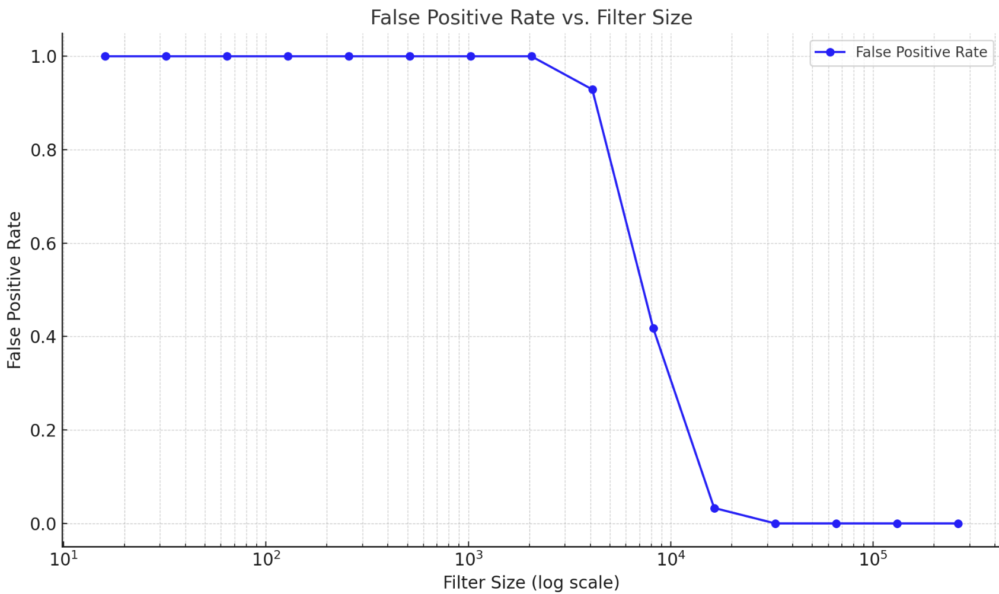
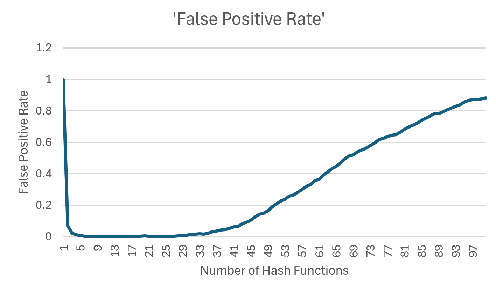

## Bloom Filters

Bloom filter is a probabilistic data structure that's used to determine if an element is in a set.

Implement Bloom Filters and measure
1. False Positive Rate vs Size of the filter
1. False Positive Rate vs Number of Hash Function

#### False positive Rate vs Size of Bloom Filter - (Single Hash Function)
Here's the data formatted as a table:

|**False Positive Rate**| **Bloom Filter Size (Single Hash)** |
|-----------|--------|
| 1.000000    |16    |
| 1.000000    |32    |
| 1.000000    |64    |
| 1.000000    |128   |
| 1.000000    |256   |
| 0.983000    |512   |
| 0.857000    |1024  |
| 0.629000    |2048  |
| 0.403000    |4096  |
| 0.234000    |8192  |
| 0.131000    |16384 |
| 0.071000    |32768 |
| 0.032000    |65536 |
| 0.015000    |131072|
| 0.006000    |262144|

#### False positive Rate vs Size of Bloom Filter - (10 Hash Function)

|False Positive Rate|	Bloom Filter Size (10 hash)|
|-----------|--------|
|1	    |16|
|1	    |32|
|1	    |64|
|1	    |128|
|1	    |256|
|1	    |512|
|1	    |1024|
|1	    |2048|
|0.929	|4096|
|0.418	|8192|
|0.033	|16384|
|0	    |32768|
|0	    |65536|
|0	    |131072|
|0	    |262144|

#### False Positive Rate vs Number of Hash Function
The sudden increase in the false positive rate after adding more hash functions is due to overhashing and the saturation of bits in the Bloom filter.

#### Conclustion
- With 10 hash functions the number of FPR reaches a low value much quick.

- But With too many hash functions FPR increases again 'cause **oversaturation** of the Bloom filter