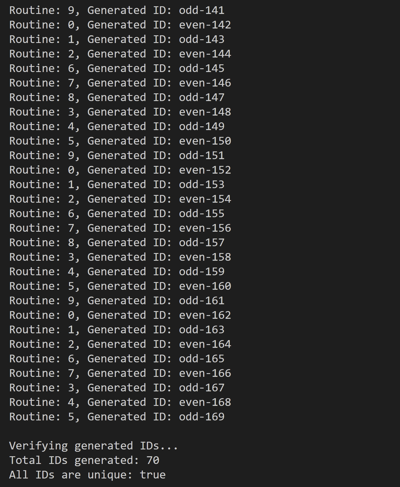

## Implementing Flickr Odd Even Generation

Flickr's odd-even ID generation: Different servers generate IDs independently by alternating between odd and even numbers, avoiding collisions and enabling efficient parallel processing.
Flickr uses odd and even prefixes to generate IDs

- Concurrency Safety: `sync.Mutex` is used.
- Alternating Odd and Even IDs: `isOddTurn` boolean is used.
- Usage: `GenerateID` alternates between odd and even, updating the respective counter.

