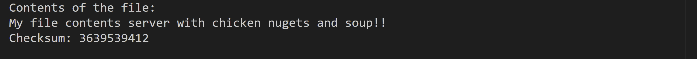
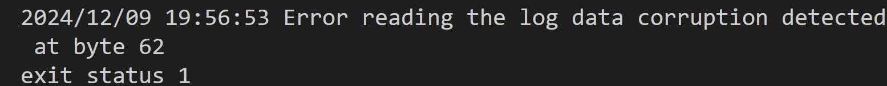

## Implement Checksum based
1. Identify if data in WAL or Bitcask is corrupt using Checksum
1. TODO: Implement database recovery as discussed in the session

### Results

#### Corrupt WAL (changed `n` to `m`)

Output

### Key Points

#### 1. Checksum Algorithm Used: CRC32  
   - CRC32 (Cyclic Redundancy Check, 32-bit) is an algorithm designed to detect accidental changes in data.  
   - Characteristics:  
     - Fast and computationally efficient - ensures integrity 
     - Produces a fixed 32-bit checksum for a given input, regardless of its length.

#### 2.  Checksum Representation 
   - In a little-endian format, the least significant byte (LSB) is stored first in memory. This byte order is critical when encoding/decoding binary data for consistent interpretation.  
   - It ensures that integers are stored or transmitted in a predictable and interoperable format, especially when communicating between systems with different native endianness (e.g., little-endian vs. big-endian). 
   - Representing the checksum in a binary format ensures efficient storage and fast network transmission.  
   `binary.LittleEndian.PutUint32(lengthBytes, dataLen)`
