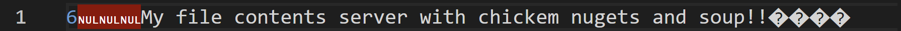

## Implement Checksum based
1. Identify if data in WAL or Bitcask is corrupt using Checksum
1. Implement database recovery as discussed in the session

Endianness Compatibility:

Little-Endian means the least significant byte (LSB) comes first in memory. Specifies the byte order for encoding/decoding.

Ensures the integer is stored or transmitted in a known byte order, which is crucial for interoperability between systems with different endianness.
Binary Format Requirements:

Many storage and communication protocols require data to be encoded in a specific byte order for checksum validation or data integrity.
Checksum Representation:

Encodes the checksum into a binary format for efficient storage or network transmission.

### Results

#### Corrupt WAL (changed `n` to `m`)

Output
