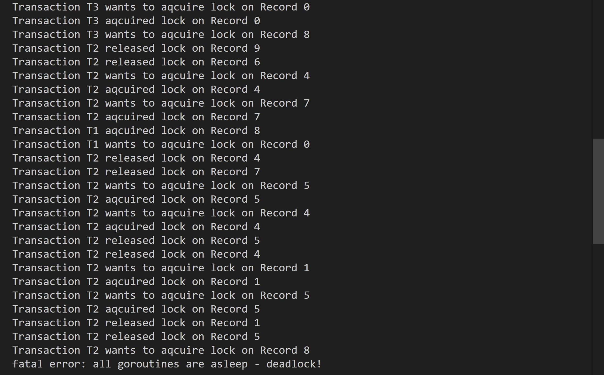

## Implementing Deadlock
A deadlock occurs when multiple transactions are stuck waiting for each other to release locks, creating a cycle of dependencies where no progress can be made.

### Deadlock Example:
In the scenario depicted:

- **T2** wants **Record 8**, but **T1** holds the lock.
- **T1** wants **Record 0**, but **T3** holds the lock.
- **T3** wants **Record 8**, causing a circular wait.



### Deadlock Prevention:
To prevent deadlocks, acquire locks in a strict, predefined order based on row indices. For example:

```
if row1 > row2 {
    tmp := row1
    row1 = row2
    row2 = tmp
}
```

This ensures consistent ordering of lock acquisition, breaking circular dependencies and avoiding deadlocks.