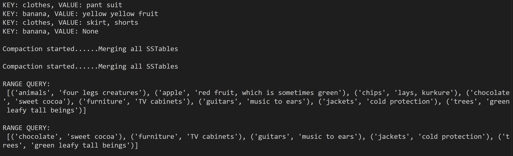

## Implement LSM Tree based KV Store

[Reference: CS265 Systems Project: An LSM-tree based key-value store](http://daslab.seas.harvard.edu/classes/cs265/project.html)  

Similar to [Word Dictionary Implementation](../28-word-dictionary-csv/), but easier in python 

An **LSM (Log-Structured Merge) Tree** is a type of key-value store architecture designed for high write throughput and efficient storage management. Widely used in modern databases like LevelDB, RocksDB, and Cassandra. LSM trees optimize for write-heavy workloads by buffering writes in memory and periodically merging them into sorted files on disk.

---

### Working Details

**Code Optimization TODO**: For range queries and Compaction can be using MIN HEAPS for sort.

1. **MemTable (In-Memory Storage):**
   - All writes (`put`, `delete`) are first written to an in-memory data structure, called the MemTable.
   - This structure allows fast writes and reads because it resides in memory.
   - The MemTable accumulates key-value pairs until it reaches a size threshold.

2. **Flush to Disk (SSTables):**
   - When the MemTable becomes full, it is sorted and written to disk as an **SSTable (Sorted String Table)**.
   - SSTables are immutable, ordered key-value stores, typically stored as serialized files on disk.

3. **Compaction:**
   - Over time, multiple SSTables accumulate, potentially leading to redundant data or fragmentation.
   - A **compaction** process merges and reorganizes SSTables, eliminating duplicate or deleted keys and maintaining sorted order for efficient range queries.

4. **Reads (MemTable + SSTables):**
   - For `get` operations, the MemTable is checked first since it holds the most recent data.
   - If the key is not found, older SSTables are searched in `reverse order` of creation (newer data is checked first).

5. **Range Queries:**
   - Range queries scan across all SSTables and the MemTable, in `ascending order`, overwriting older values with new ones, aggregating matching key-value pairs within the specified range.

---

#### Key Features and Advantages of LSM Trees

- **Write Optimization:**
  - Writes are buffered in memory, reducing frequent disk I/O.

- **Efficient Compaction:**
  - Periodic compaction ensures disk space is reclaimed, and data remains sorted for quick access.

- **Sequential Disk Writes:**
  - Writing SSTables is sequential, avoiding the overhead of random I/O.

- **Read Trade-offs:**
  - Reads may involve checking multiple SSTables, but techniques like **bloom filters** can mitigate this overhead.

---

#### Advantages of LSM Trees

- High write throughput due to sequential writes.
- Compact storage with minimal fragmentation.
- Good for workloads with frequent writes and infrequent reads.
